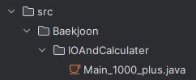
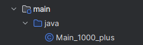

gradle 
- 프로젝트 유형 : java -> gradle
  - 파일 생성 > 파일명 : build.gradle, settings.gradle
  - 1. 자바실행이 안되는 현상 -> main/java 하위폴더에서 실행 가능
    - 실행 실패 : 
    - 실행 성공 : 
       (cf.   - https://velog.io/@sa1341/Gradle-%EA%B8%B0%EB%B3%B8-%EB%8B%A4%EC%A7%80%EA%B8%B0-1%ED%8E%B8
      )

spock
- 선행 : gradle 및 groovy 의존성 추가
  - 1. groovy실행이 안되는 현상 -> src/test/groovy폴더에서 실행 + groovy확장자에서 실행
    - 싫행 실패 : .java파일
    - 실행 성공 : .groovy파일
        https://mihee0703.tistory.com/196
  - 2. 일반 자바프로젝트에서도 실행 가능 
         https://goodteacher.tistory.com/336
- 사용법
  - spock에는 6개의 블록이 있다. given/when/then/expect,cleanup,where
  - 메서드에는 최소 하나의 블록이 존재해야합니다.
    - given/when/then
      - given : 설정 작업수행,생략 가능
      - when : 테스트 코드를 실행하는 블록
      - then : when과 then은 항상 함께 사용되며, then블록에서 검증합니다.
      - 메서드는 여러 쌍의 when-then 블록을 사용할 수 도 있스니다.
    - expect, where
      - expect : 테스트 코드 실행과 검증을 한번에 할 수 있습니다. 
      - where : 다양한 케이스를 검증할 수 있습니다.
  -  https://greeng00se.tistory.com/139 